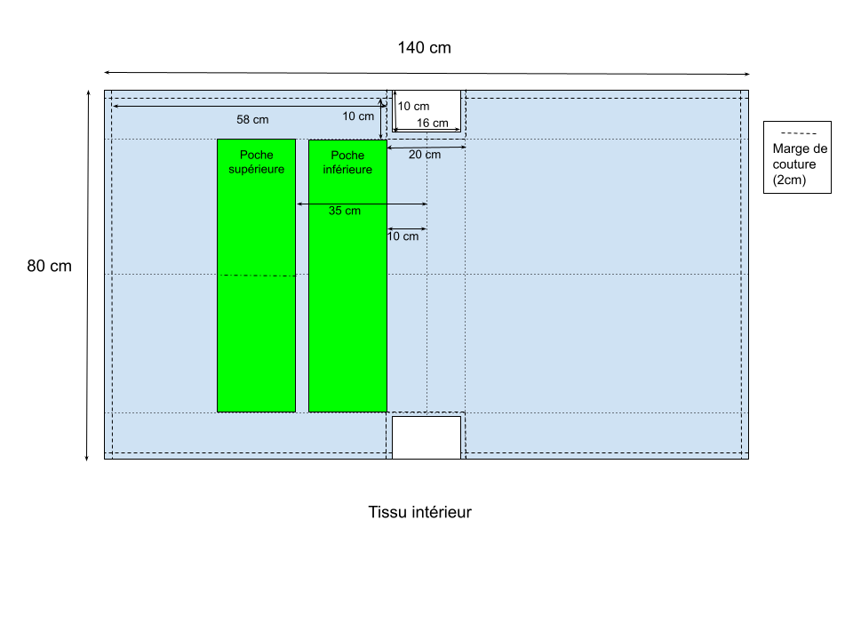
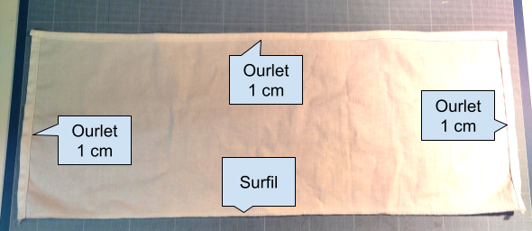
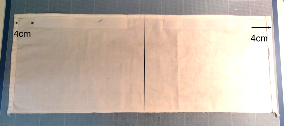
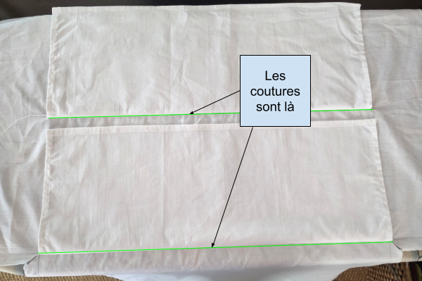
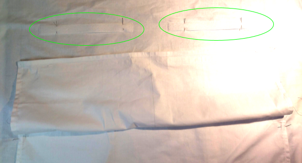
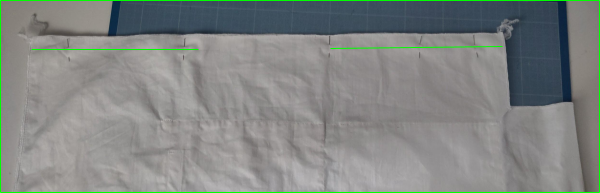
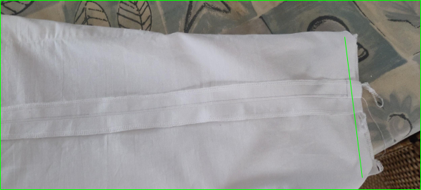

# Préparation de la doublure et des poches

## Découpe des pièces

Découper le tissu intérieur selon le patron.  Les marges de couture valent 2cm et sont comprises dans le schéma. 

Marquer les emplacements des poches sur l'endroit.

Découper les rectangles de tissu pour les poches (2 fois 24x60cm)

## Instructions de montage

### Préparation des poches

Surfiler ou surjeter un bord long sur chaque rectangle. Ce côté constituera le fond de la poche. 

Faire un ourlet d’1cm sur tous les autres côtés en commençant par les 2 petits côtés.

Vous obtenez 2 rectangles de 56x21cm.

Sur l’un des rectangles, poser puis coudre un morceau de bande agrippante (face crochet) à 4cm du bord d’un côté et le long de l’ourlet. Faire de même pour l’autre bande agrippante.

### Pose des poches

Positionner sur l'endroit de la doublure le bas de chaque poche, endroit contre endroit. 

Coudre le bas de la poche puis plier le long de la couture pour lui donner sa place. 

Pour la poche haute, positionner la face douce des bandes agrippantes en face des bandes déjà posées et les coudre.
  
  
*Positionnement des bandes agrippantes (partie douce)*

Pour chaque poche, faire une couture le long des petits côtés.  

Pour la poche haute, faire une couture au milieu, parallèle aux petits côtés, pour diviser la poche en 2.

### Fermeture de la doublure

Plier la doublure endroit contre endroit.

Coudre les côtés à 2cm du bord en laissant une ouverture de 15cm d’un côté pour retourner le sac à la fin.

Former le fond de chaque côté en écrasant les angles, coudre le fond de chaque côté

