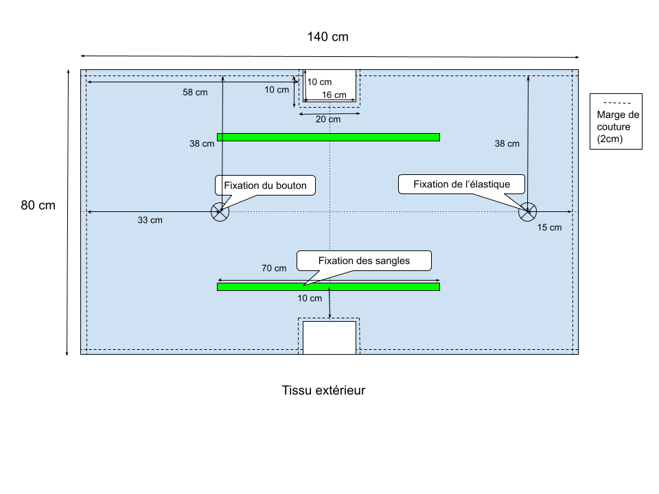
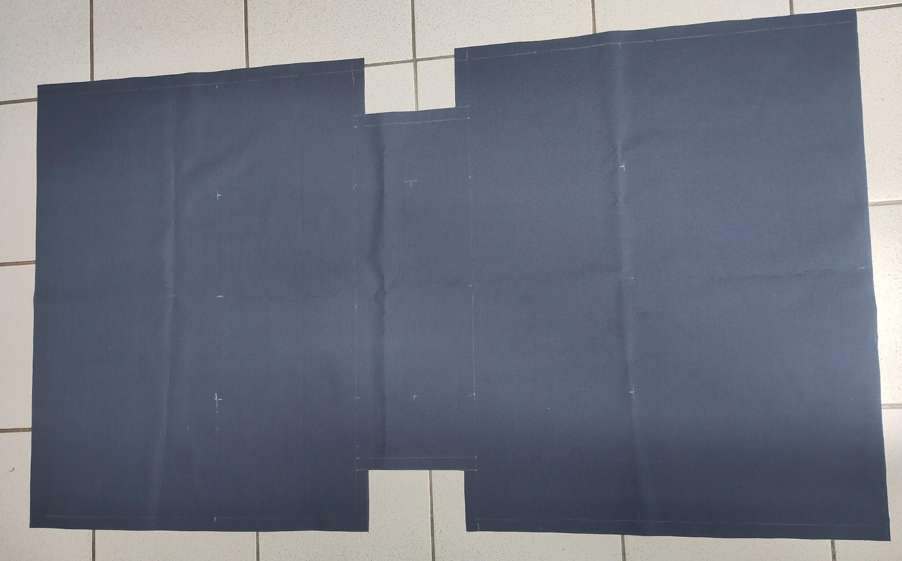
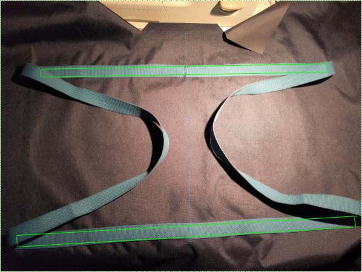
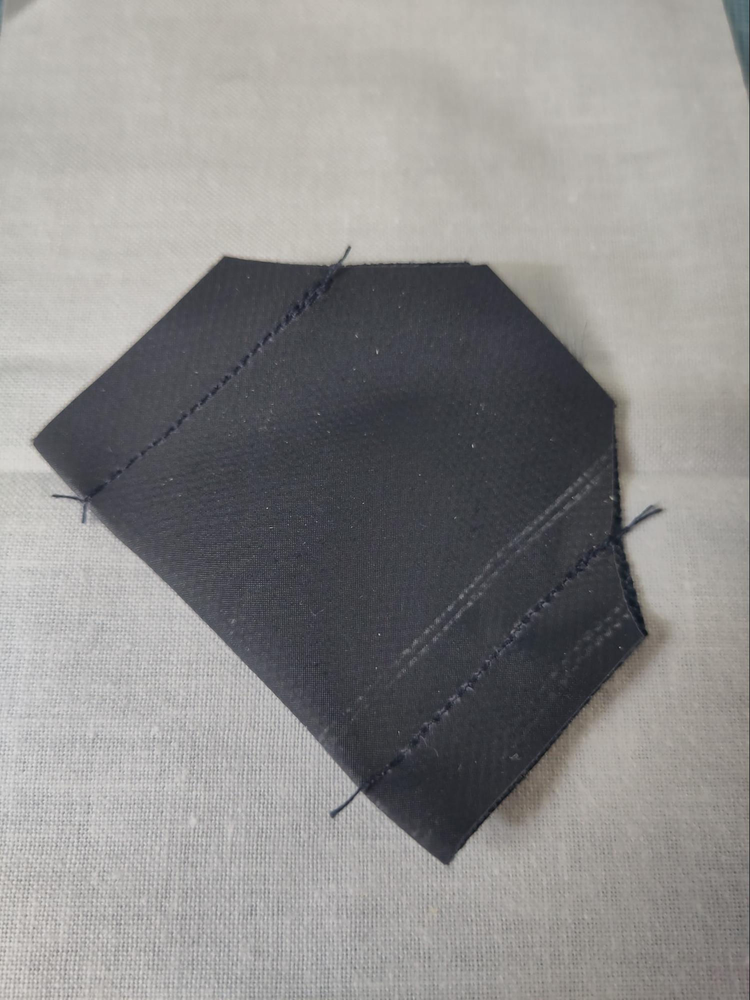
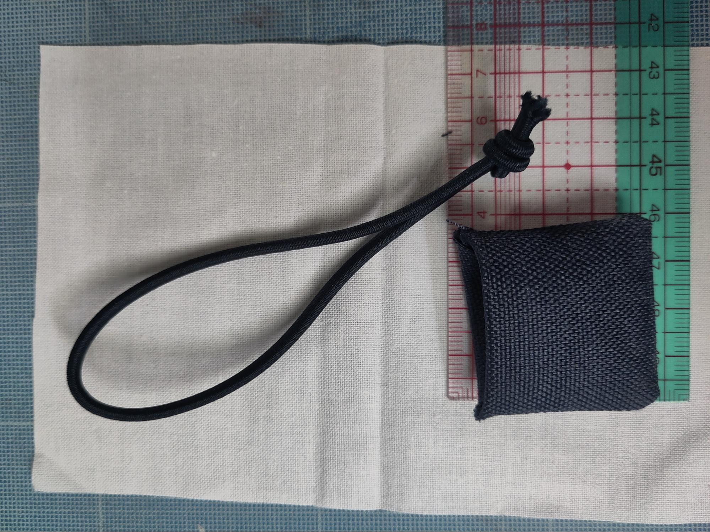
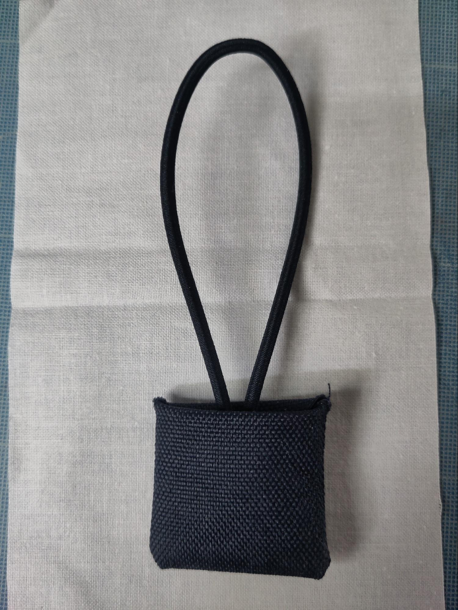
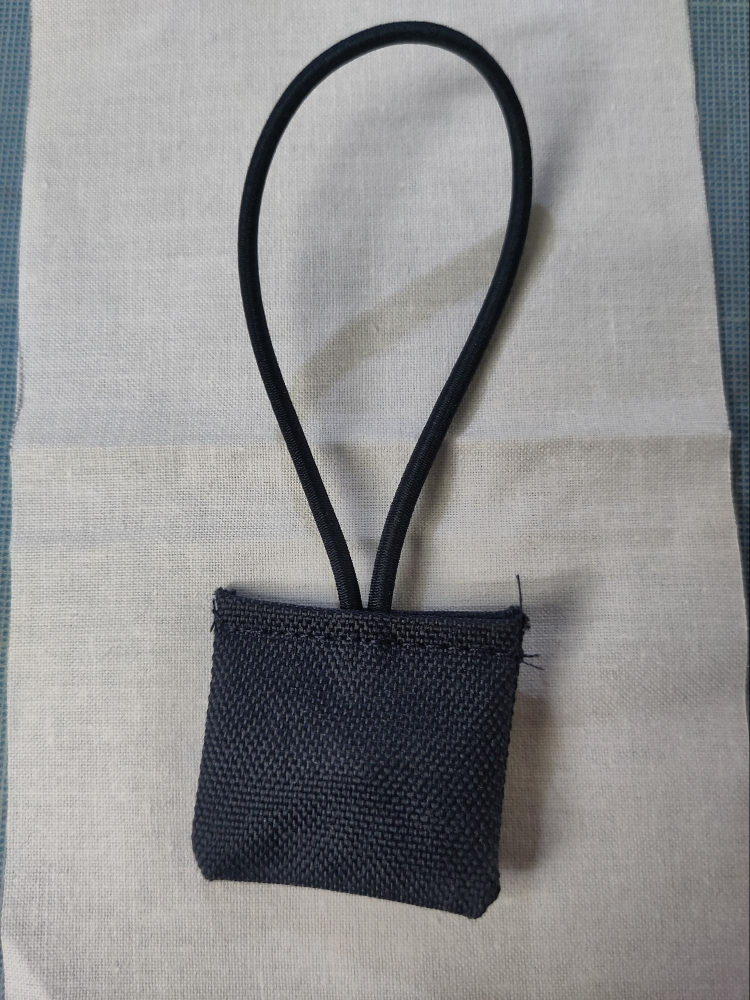
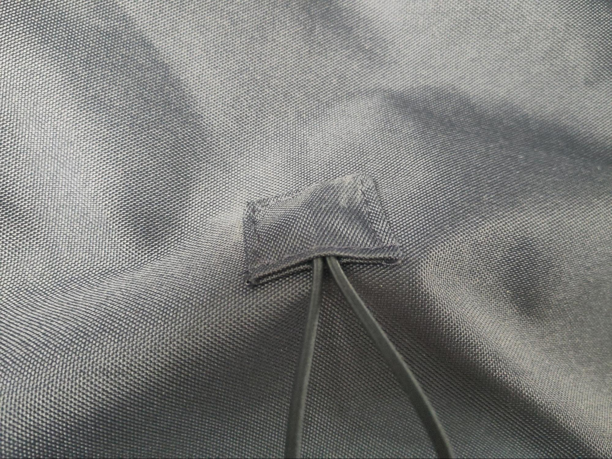
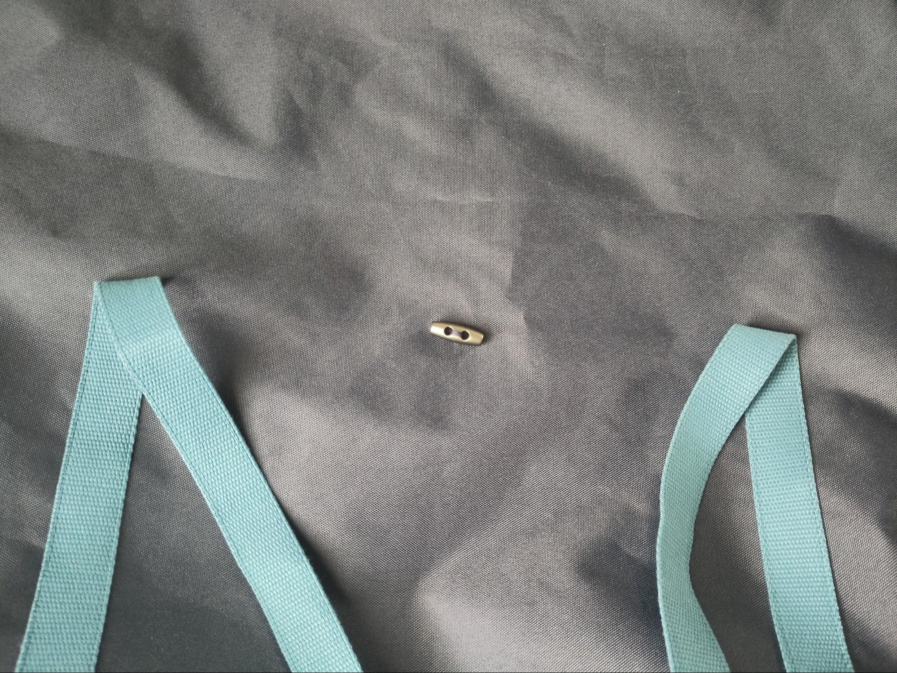

# Préparation de l'extérieur du sac

## Découpe des pièces

  

Découper le tissu extérieur selon le patron. Les marges de couture valent 2cm et sont comprises dans le schéma.

⚠️ Conserver l’un des rectangles 10x16cm, il sera utilisé pour le système de fixation de l’élastique.

Pour un placement plus facile des pièces, tracer les axes du milieu du tissu dans la longueur et la largeur sur l'endroit du tissu.

Marquer les emplacements des sangles, du bouton et de la fixation de l’élastique sur l'endroit du tissu.

## Instructions de montage

### Pose des sangles

Repérer le milieu de la longueur de la sangle

Positionner les sangles sur l’endroit du tissu selon le schéma. 

Les 2 bouts des sangles doivent être face à face au milieu du fond.

Le milieu de la sangle est également au milieu du fond.

Coudre les sangles : faire une couture des 2 cotés de chaque sangle, sur 35cm à partir du milieu du fond.

### Préparation de la fixation de l’élastique

Plier en 2 le rectangle de 10cm x 6cm, endroit contre endroit  

Piquer de chaque coté à 1cm du bord  

Couper les angles pour préparer la fermeture  

Retourner la pièce pour exposer l’endroit  

Plier l’élastique en 2, faire un noeud et le glisser dans la pièce préparée.
|||
|-|-|
|||

Replier le bord ouvert vers l’intérieur et faire une piqure pour fermer la pièce en prenant l’élastique  

### Pose de l’élastique

Positionner la pièce préparée à l’endroit marqué sur l’endroit du tissu extérieur, faire une piqure proche du bord sur tout le tour de la pièce

### Pose du bouton

Coudre la buchette à l’endroit marqué sur l’endroit du tissu extérieur  

### Fermeture du tissu extérieur

Cette opération est la même que pour la doublure, mais sans laisser d'ouverture.

Plier le tissu endroit contre endroit  

Coudre les côtés à 2cm du bord.

Former le fond de chaque côté en écrasant les angles, coudre le fond de chaque côté

