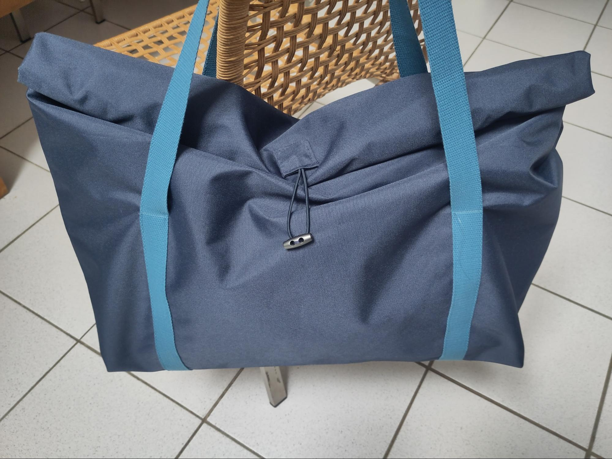
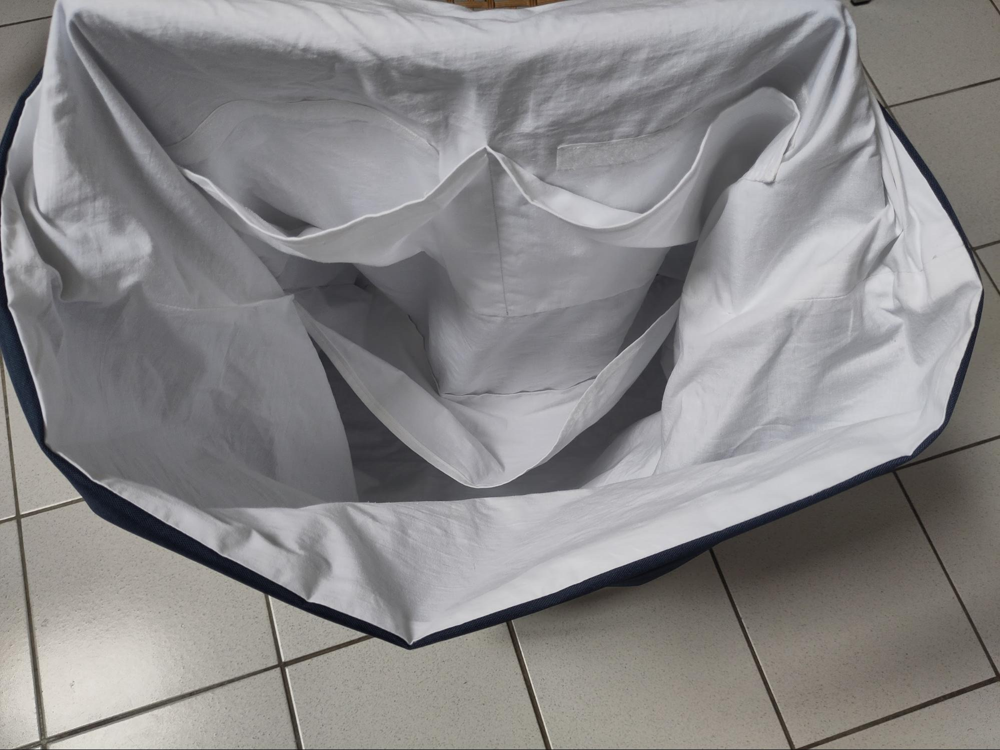

# Sac pour BrailleRAP XL

## Patron et instructions de montage

|  |  |
| - | - |
|  |  |

Le sac présenté ici comporte 3 poches intérieures : une grande poche inférieure et 2 petites poches supérieures fermées par bande agrippante. 

Ces poches sont facultatives et modifiables en fonction de vos besoins.  

La poche inférieure est grande, vous pouvez la fermer avec un carré de bande agrippante pour lui éviter de bailler. Cette option n’est pas décrite dans ce document.

> Si vous êtes perdu dans les instructions de montage ou la compréhension du patron, vous pourriez apprécier ce tuto, en laissant de côté la partie fermeture éclair https://www.youtube.com/watch?v=T17bP8SbFsI  

## Matériel nécessaire

* Tissu extérieur : 80cm en 140cm  
* Doublure : 80cm en 140cm  
* Poches :   
  * 2 rectangles de 24x60cm  
  * Bande agrippante  à coudre : 2x20cm pour les 2 poches supérieures  
* Sangle : 3m en largeur 3cm  
* Fermeture :  
  * 1 bouton type buchette  
  * élastique rond diamètre 3mm \- 30cm  
  * 1 rectangle de tissu extérieur 10cm x 6cm

## Préparer la doublure et les poches

Voir les [instructions pour la préparation de la doublure et des poches](./HOW-TO-In_FR-fr.md) 

## Préparer l'extérieur

Voir les [instructions pour la préparation de l'extérieur du sac](./HOW-TO-Out_FR-fr.md) 

## Assembler le sac

Rentrer les 2 éléments du sac l’un dans l’autre, endroit contre endroit.

Ajuster les bords et coudre tout le long à 2cm du bord

Repasser les coutures

Retourner le tout par l’ouverture laissée dans la couture de la doublure  

Ajuster le tout, fermer la doublure à la main ou par une couture proche du bord.

C'est fini !
