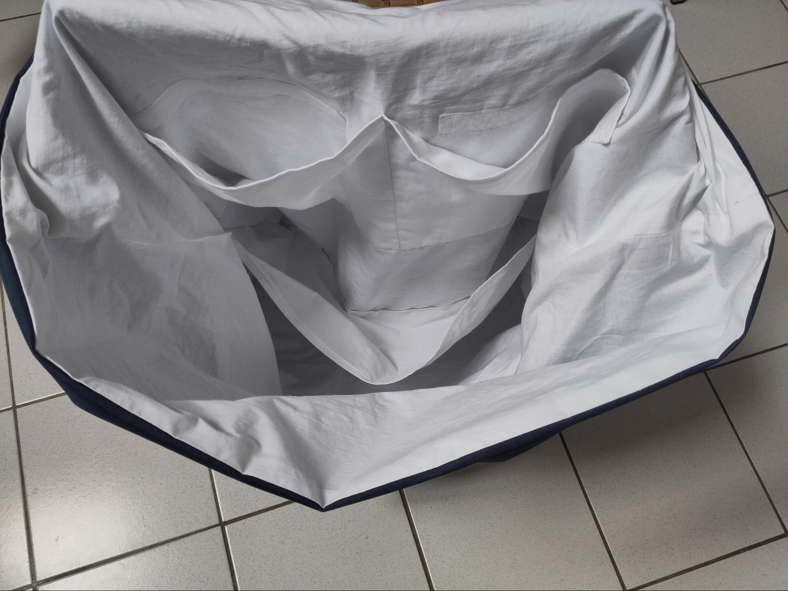
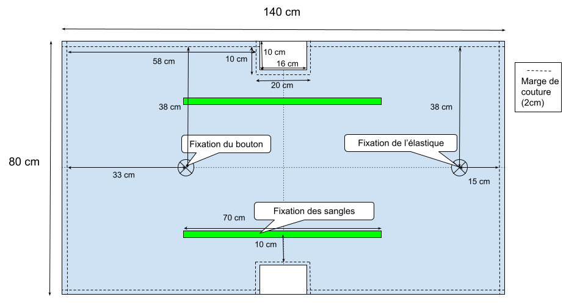
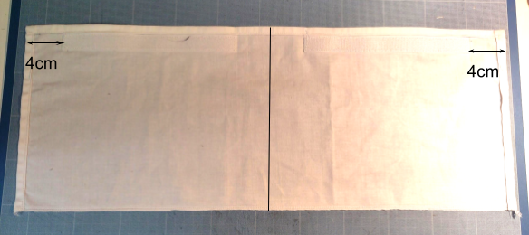
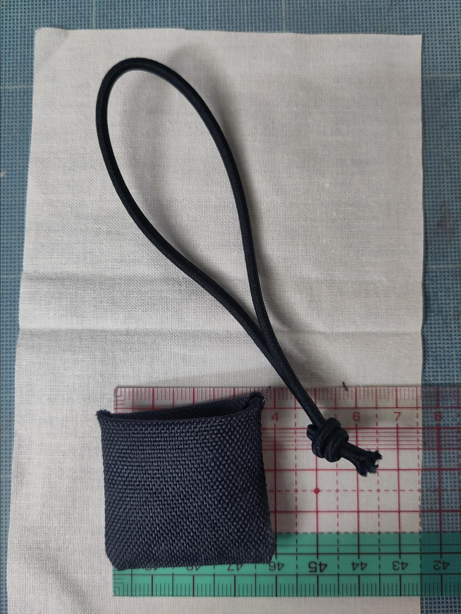
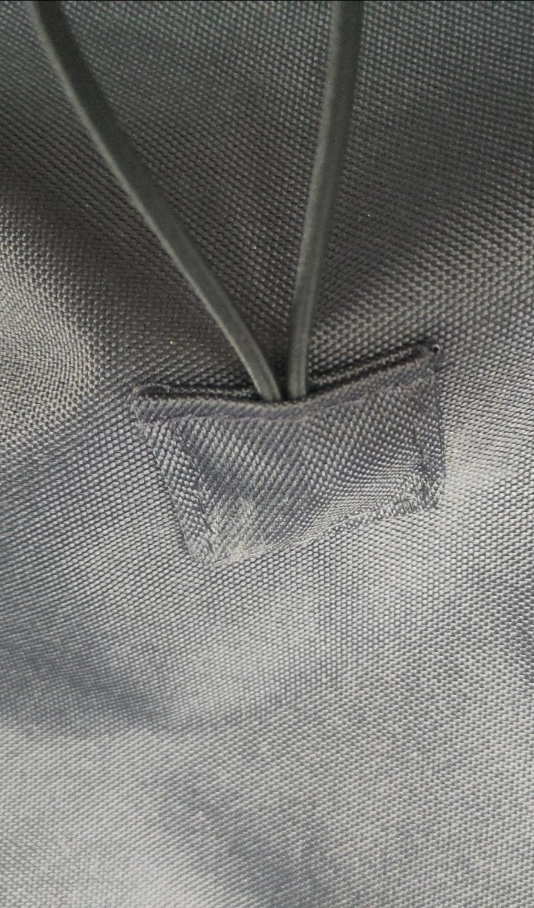

# Sac pour BrailleRAP XL

## Patron et instructions de montage

 

Le sac présenté ici comporte 3 poches intérieures : une grande poche inférieure et 2 petites poches supérieures fermées par bande agrippante. 

Ces poches sont facultatives et modifiables en fonction de vos besoins.  

La poche inférieure est grande, vous pouvez la fermer avec un carré de bande agrippante pour lui éviter de bailler. Cette option n’est pas décrite dans ce document.

> Si vous êtes perdu dans les instructions de montage ou la compréhension du patron, vous pourriez apprécier ce tuto, en laissant de côté la partie fermeture éclair https://www.youtube.com/watch?v=T17bP8SbFsI  

# Matériel nécessaire

* Tissu extérieur : 80cm en 140cm  
* Doublure : 80cm en 140cm  
* Poches :   
  * 2 rectangles de 24x60cm  
  * Bande agrippante  à coudre : 2x20cm pour les 2 poches supérieures  
* Sangle : 3m en largeur 3cm  
* Fermeture :  
  * 1 bouton type buchette  
  * élastique rond diamètre 3mm \- 30cm  
  * 1 rectangle de tissu extérieur 10cm x 6cm

# Découpe des pièces

  

Découper le tissu extérieur selon le patron.Conserver l’un des rectangles 10x16cm, il sera utilisé pour le système de fixation de l’élastique.

Marquer les emplacements des sangles, du bouton et de la fixation de l’élastique  

Découper le tissu intérieur selon le patron. Marquer les emplacements des poches.

Découper les rectangles de tissu pour les poches (2 fois 24x60cm)

# Instructions de montage

## Préparation des poches

Surfiler ou surjeter un bord long sur chaque rectangle. Ce côté constituera le fond de la poche. 

Faire un ourlet d’1cm sur tous les autres côtés en commençant par les 2 petits côtés.

Vous obtenez 2 rectangles de 56x21cm.

Sur l’un des rectangles, poser puis coudre un morceau de bande agrippante (face crochet) à 4cm du bord d’un côté et le long de l’ourlet. Faire de même pour l’autre bande agrippante.

## Préparation de la doublure

### Pose des poches

Positionner le bas de chaque poche, endroit contre endroit. 

Coudre le bas de la poche puis plier le long de la couture pour lui donner sa place. 

Pour la poche haute, positionner la face douce des bandes agrippantes en face des bandes déjà posées et les coudre.
  
  
*Positionnement des bandes agrippantes (partie douce)*

Pour chaque poche, faire une couture le long des petits côtés.  

Pour la poche haute, faire une couture au milieu, parallèle aux petits côtés, pour diviser la poche en 2\.

### Préparation de la doublure

Plier la doublure endroit contre endroit  

Coudre les côtés à 2cm du bord en laissant une ouverture de 15cm d’un côté pour retourner le sac à la fin.

Former le fond de chaque côté en écrasant les angles, coudre le fond de chaque côté

## Préparation de l’extérieur

### Pose des sangles

Positionner les sangles sur l’endroit du tissu extérieur selon le schéma. Les 2 bouts des sangles doivent être face à face au milieu du fond.

Coudre les sangles : faire une couture des 2 cotés de chaque sangle, sur 35cm à partir du milieu du fond.

### Préparation de la fixation de l’élastique

Plier en 2 le rectangle de 10cm x 6cm, endroit contre endroit  

Piquer de chaque coté à 1cm du bord  

Couper les angles pour préparer la fermeture  

Retourner la pièce pour exposer l’endroit  

Plier l’élastique en 2, faire un noeud et le glisser dans la pièce préparée.

Replier le bord ouvert vers l’intérieur et faire une piqure pour fermer la pièce en prenant l’élastique  

### Pose de l’élastique

Positionner la pièce préparée à l’endroit marqué sur l’endroit du tissu extérieur, faire une piqure proche du bord sur tout le tour de la pièce

### Pose du bouton

Coudre la buchette à l’endroit marqué sur l’endroit du tissu extérieur  

### Préparation du tissu extérieur

Cette étape est identique à la préparation de la doublure, mais sans laisser d’ouverture dans la couture :  
* Plier le tissu extérieur endroit contre endroit  
* Coudre les côtés à 2cm du bord  
* Former le fond de chaque côté en écrasant les angles, coudre le fond de chaque côté

## Assemblage

Rentrer les sacs l’un dans l’autre, endroit contre endroit.   

Ajuster les bords et coudre tout le long à 2cm du bord

Repasser les coutures en les écartant

Retourner le tout par l’ouverture laissée dans la couture de la doublure  

Ajuster le tout, fermer la doublure à la main ou par une couture proche du bord

